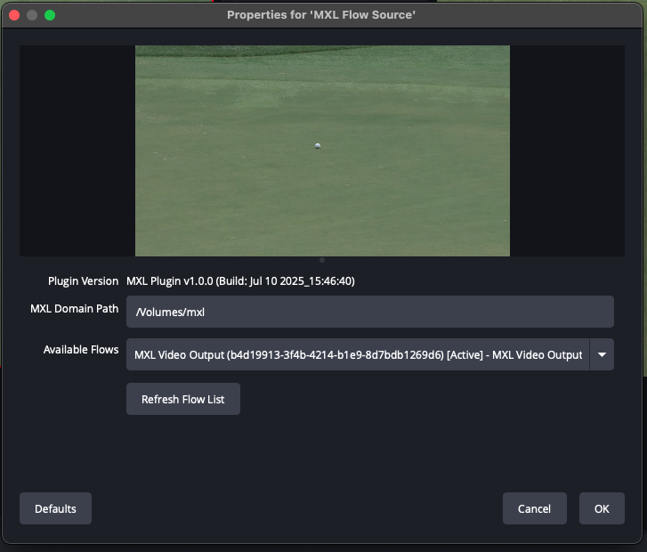

# OBS MXL Plugin

An OBS Studio plugin that allows you to use MXL (Media Exchange Layer) flows as video/audio sources.

## ⚠️ Current Limitations

- **Platform Support**: Currently only supports macOS and Linux. Windows support coming soon.
- **Media Support**: Video and audio flows. Audio is limited to one channel selection.
- **Resolution Testing**: Only tested with 1920x1080 video resolutions.

## Overview

This plugin enables OBS Studio to consume video/audio streams from MXL flows, allowing for low-latency, high-performance video/audio sharing between applications using shared memory.



## Features

- Real-time video capture from MXL flows
- Support for multiple video formats (RGBA, V210, I420, NV12)
- Configurable domain path and flow ID
- Automatic frame rate detection
- Thread-safe frame processing
- Basic audio support (limited to one channel selection. Will be fixed soon)

## Prerequisites

- OBS Studio (version 28.0 or later)
- MXL SDK installed and configured
- **macOS**: macOS 10.15+ 
- **Linux**: Ubuntu 20.04+ or equivalent (with obs-studio-dev package)

## Building

### 1. Build and Install MXL SDK

**macOS:**
```bash
cd /path/to/mxl
mkdir build && cd build
cmake .. --preset Darwin-Clang-Release
cmake --build . --target all
cmake --install . --prefix ~/mxl-sdk
```

**Linux:**
```bash
cd /path/to/mxl
mkdir build && cd build
cmake .. -DCMAKE_BUILD_TYPE=Release
cmake --build . --target all
cmake --install . --prefix ~/mxl-sdk
```

### 2. Build the Plugin

**macOS:**
```bash
cd obs-mxl-input-plugin
./build-macos.sh
```

**Linux:**
```bash
cd obs-mxl-input-plugin

# Use the Linux setup script (recommended)
./build-linux.sh
```

The Linux build script will automatically:
- Check for required dependencies (build-essential, cmake, pkg-config)
- Verify OBS Studio installation and headers
- Set up proper environment variables
- Build and install the plugin

## Installation

The build scripts automatically install the plugin to:

**macOS:**
```
~/Library/Application Support/obs-studio/plugins/obs-mxl-plugin.plugin/
```

**Linux:**
```
~/.config/obs-studio/plugins/obs-mxl-plugin/
```

The scripts also handle platform-specific library path configuration automatically.

## Usage

1. **Set up MXL Domain**: Ensure your MXL domain directory exists and contains active flows.

2. **Add Source in OBS**:
   - Open OBS Studio
   - Click the "+" in Sources
   - Select "MXL Flow Source"
   - Give it a name and click OK

3. **Configure Source**:
   - **MXL Domain Path**: Path to your MXL domain directory (e.g., `/tmp/mxl_domain`)
   - **Flow ID**: UUID of the MXL flow you want to capture

4. **Test with MXL Tools**:
   ```bash
   # List available flows
   ./mxl-info -d /tmp/mxl_domain -l
   
   # Create a test video source
   ./mxl-gst-videotestsrc -d /tmp/mxl_domain -f flow_config.json
   ```
You can find MXL Tools with audio support here: [mxl-tools with audio](https://github.com/dmf-mxl/mxl/pull/208)


## Supported Video Formats

- **video/raw**: RGBA format
- **video/x-raw**: RGBA format  
- **video/v210**: 10-bit YUV 4:2:2
- **video/yuv420p**: I420 format
- **video/nv12**: NV12 format

## Supported Audio Formats

- **audio/float32**

## Troubleshooting

### Plugin Not Loading
- Check OBS Studio logs for error messages
- Ensure MXL SDK is properly installed
- Verify plugin is in the correct directory

### No Video Appearing
- Verify MXL domain path is correct
- Check that the flow ID exists using `mxl-info`
- Ensure the flow is actively producing frames
- Check OBS Studio logs for MXL-related errors

### Performance Issues
- Ensure MXL domain is on tmpfs/memory filesystem
- Check system resources (CPU, memory)
- Verify flow grain rate matches expected frame rate

## Development

### Code Structure
- `src/obs-mxl-source.cpp`: Plugin registration and entry point
- `src/mxl-source.cpp`: Main source implementation
- `src/mxl-source.h`: Header definitions

### Key Components
- **mxl_source_data**: Main data structure holding MXL and OBS state
- **capture_loop()**: Background thread for reading MXL grains
- **process_grain()**: Frame processing and format conversion
- **OBS callbacks**: Integration with OBS Studio source API

### Extending the Plugin
- Add support for audio flows
- Implement additional video format conversions
- Add flow discovery/browsing UI
- Implement flow statistics and monitoring

## License

This plugin follows the same license as the MXL SDK (Apache 2.0).

## Contributing

1. Fork the repository
2. Create a feature branch
3. Make your changes
4. Test thoroughly
5. Submit a pull request
