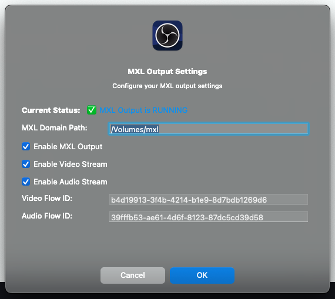

# OBS MXL Output Plugin

This plugin allows OBS Studio to output video streams in MXL (Media Exchange Layer) format, enabling real-time media exchange between applications using the MXL framework.

## ⚠️ Important Notes

- **Resolution Requirement**: Currently only works with **1920x1080** resolution. In OBS, go to Settings → Video → Output (Scaled) Resolution and set to 1920x1080.
- **Video Only**: Currently only supports video output. Audio support is coming soon.
- **Platform Support**: Currently working on **macOS** and **Linux** only. Windows support is under development.

## Screenshot



## Features

- **Real-time Output**: Stream OBS video output directly to MXL flows
- **Native Configuration Dialog**: Clean, platform-native settings interface
- **Flow Management**: Automatic creation of MXL flow descriptors and writers
- **Cross-platform**: Works on macOS and Linux

## Requirements

- OBS Studio (version 28.0 or later)
- MXL SDK installed and configured
- CMake 3.20 or later
- C++17 compatible compiler

## Building

### Prerequisites

1. **Install MXL SDK**: Build and install the MXL SDK to a known location
2. **OBS Studio**: Either install OBS Studio or build from source

### macOS

```bash
# The build script will use default paths:
# OBS_SOURCE_DIR: $HOME/obs-studio
# MXL_SDK_PREFIX: $HOME/mxl-sdk/usr/local

# Build with defaults
./build-macos.sh

# Or specify custom paths
OBS_SOURCE_DIR=/path/to/obs-studio MXL_SDK_PREFIX=/path/to/mxl-sdk ./build-macos.sh
```

### Linux

```bash
# The script will check for dependencies and guide you through installation
./build-linux.sh
```

The Linux build script will automatically:
- Check for required packages (build-essential, cmake, pkg-config, libgtk-3-dev)
- Detect OBS Studio installation and headers
- Find MXL SDK in common locations
- Guide you through installing missing dependencies

### Manual Build

```bash
mkdir build && cd build
cmake .. -DCMAKE_BUILD_TYPE=Release
cmake --build .
cmake --install .
```

## Installation

The build script automatically installs the plugin to the appropriate OBS plugin directory:

- **macOS**: `~/Library/Application Support/obs-studio/plugins/obs-mxl-output-plugin.plugin`
- **Linux**: `~/.config/obs-studio/plugins/obs-mxl-output-plugin`

After installation, restart OBS Studio to load the plugin.

## Usage

### Configuration

1. **Open Settings**: In OBS, go to Tools → MXL Output Settings
2. **Configure Settings** in the native dialog:
   - **Current Status**: Shows real-time output status at the top
   - **MXL Domain Path**: Path to your MXL domain directory
   - **Enable MXL Output**: Master toggle for the output
   - **Enable Video Stream**: Toggle video stream output
   - **Video Flow ID**: UUID for the video flow (auto-generated if empty)

3. **Apply Changes**: Click OK to save and immediately apply settings

### Key Features

- **Real-time Status**: Current output status displayed in the settings dialog
- **Immediate Application**: Settings changes take effect immediately without OBS restart
- **Auto-restart**: Output automatically restarts when stream configuration changes
- **Persistent Settings**: Configuration saved to dedicated config file

## Configuration

### MXL Domain Path

The domain path is where MXL flows are stored. This should be a directory accessible to both the output plugin and any consuming applications.

Example: `/home/user/mxl_domain` or `/Users/user/mxl_domain`

### Flow IDs

Flow IDs are UUIDs that uniquely identify each MXL flow. If left empty, the plugin will auto-generate them. You can specify custom UUIDs if you need predictable flow identifiers.

Example: `5fbec3b1-1b0f-417d-9059-8b94a47197ed`

## Flow Descriptors

The plugin automatically creates NMOS-style flow descriptor JSON files for each flow:

### Video Flow Descriptor
```json
{
  "description": "MXL Video Output Flow",
  "id": "video-flow-uuid",
  "format": "urn:x-nmos:format:video",
  "media_type": "video/x-raw",
  "grain_rate": {
    "numerator": 30,
    "denominator": 1
  },
  "frame_width": 1920,
  "frame_height": 1080,
  "colorspace": "BT709"
}
```


## Configuration File

Settings are stored in a dedicated configuration file:
- **macOS**: `~/Library/Application Support/obs-studio/plugin_config/mxl-output-config.ini`
- **Linux**: `~/.config/obs-studio/plugin_config/mxl-output-config.ini`

This file persists settings independently of OBS configuration and can be manually edited if needed.

## Troubleshooting

### Plugin Not Loading

1. Check OBS log for error messages
2. Verify MXL SDK is properly installed
3. Ensure plugin is in the correct directory
4. Check file permissions

### Settings Not Persisting

1. Check that the plugin config directory is writable
2. Verify the config file path in the logs
3. Ensure sufficient disk space

### Flow Creation Errors

1. Verify MXL domain path exists and is writable
2. Check disk space
3. Ensure no conflicting flow IDs

### Performance Issues

1. Monitor CPU usage - MXL operations are CPU intensive
2. Consider reducing video resolution/framerate
3. Check available memory

## Logging

The plugin uses OBS's logging system with clean, focused output:

```
=== LOADING MXL OUTPUT PLUGIN v0.0.1 ===
MXL Output: Output type registered successfully
MXL Output: Settings updated - Output: enabled, Video: enabled
MXL Output: Starting output
MXL Output: Output started successfully - Video: enabled
```

Enable OBS debug logging to see detailed MXL operations.


## License

This plugin is licensed under the Apache 2.0 License.

## Contributing

Contributions are welcome! Please follow the MXL project's contribution guidelines.

## Support

For issues and questions:
1. Check the MXL project documentation
2. Review OBS plugin development guides
3. File issues in the MXL project repository
